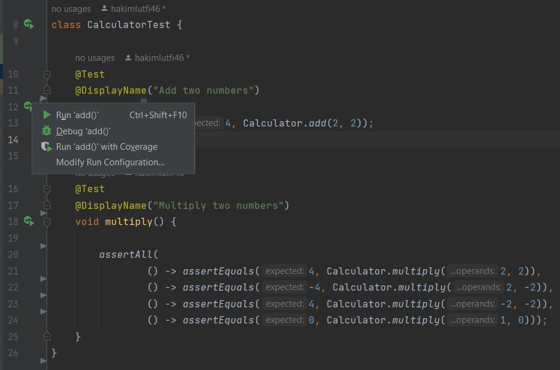
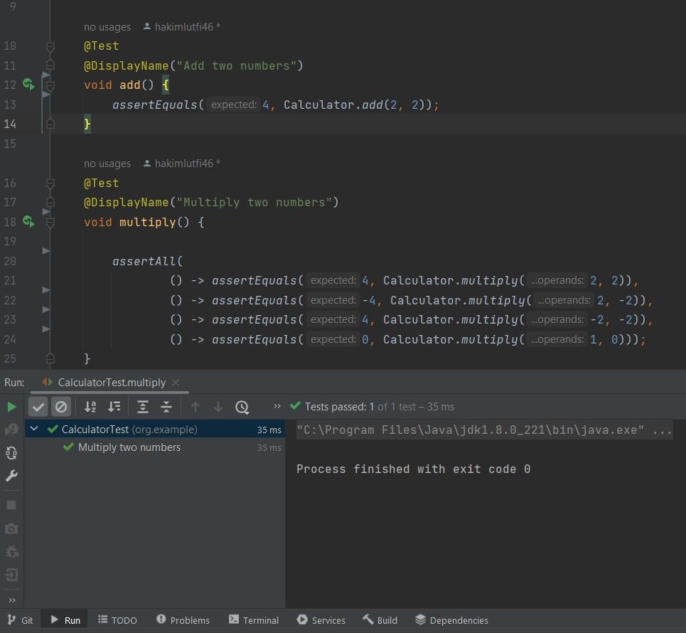
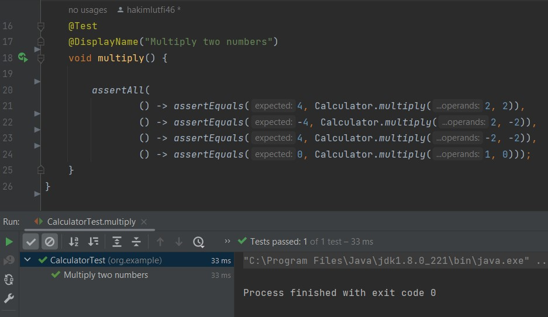
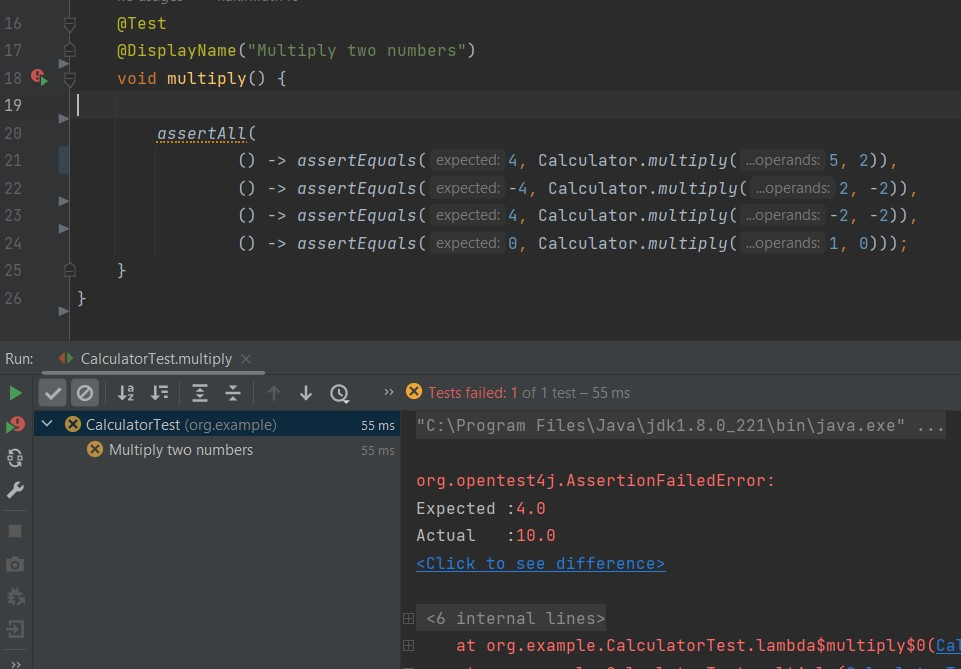

# Unit Testing
Unit testing adalah pengujian terhadap perangkat lunak atau komponen dari sebuah perangkat lunak. Pengujian ini dilakukan selama masa pengembangan aplikasi oleh developer. Unit yang diuji bisa berupa kode, fungsi, metode, prosedur, modul, atau objek tersendiri. Tujuan dari pengujian ini adalah untuk memverifikasi bahwa masing-masing unit berjalan sesuai ekspektasi dengan berbagai keadaan. Untuk selengkapnya bisa akses pada [Unit Testing](https://stackoverflow.com/questions/652292/what-is-unit-testing-and-how-do-you-do-it).

## Unit Testing dengan JUnit
Dalam Java, JUnit adalah salah satu framework unit testing yang paling umum digunakan. Mari kita lihat cara membuat unit test sederhana dengan JUnit.

### 1. Tambahkan Dependensi JUnit

Pastikan Anda telah menambahkan dependensi JUnit ke proyek Anda. Jika Anda menggunakan Maven, tambahkan dependensi ini ke berkas `pom.xml`

        <dependency>
            <groupId>org.junit.jupiter</groupId>
            <artifactId>junit-jupiter</artifactId>
            <version>5.10.0</version>
        </dependency>

### 2. Buat Kode Aplikasi

    package org.example;
    import java.util.stream.DoubleStream;

    public class Calculator {

        static double add(double... operands) {
            return DoubleStream.of(operands).sum();
        }

        static double multiply(double... operands) {
            return DoubleStream.of(operands).reduce(1, (a, b) -> a * b);
        }
    }

### 3. Buat Kelas Unit Test
Buat kelas unit test dengan metode pengujian. Misalnya:

    package org.example;
    import org.junit.jupiter.api.DisplayName;
    import org.junit.jupiter.api.Test;
    import static org.junit.jupiter.api.Assertions.*;

    class CalculatorTest {

    @Test
    @DisplayName("Add two numbers")
    void add() {
        assertEquals(4, Calculator.add(2, 2));
    }
        
    @Test
    @DisplayName("Multiply two numbers")
    void multiply() {
        assertAll(
        () -> assertEquals(4, Calculator.multiply(2, 2)),
        () -> assertEquals(-4, Calculator.multiply(2, -2)),
        () -> assertEquals(4, Calculator.multiply(-2, -2)),
        () -> assertEquals(0, Calculator.multiply(1, 0)));
        }
    }

Dalam contoh di atas, kita membuat kelas CalculatorTest yang menggunakan JUnit. Metode testAddition menguji metode add dari kelas Calculator dan memeriksa apakah hasilnya sesuai dengan yang diharapkan.

### 4. Menjalankan Unit Testing
Setelah kita menyiapkan kode untuk pengujian, kita dapat menjalankan pengujian dan mengetahui apakah metode yang diuji berfungsi dengan benar.

- Menjalankan pengujian individual, klik Status pengujian konfigurasi proses aplikasi dijalankan di selokan dan pilih `run`

- Untuk menjalankan semua pengujian di kelas pengujian, klik Status pengujian konfigurasi proses aplikasi dijalankan terhadap deklarasi kelas pengujian, lalu pilih Jalankan

### 5. Hasil Pengujian
Hasil pengujian akan ditampilkan, dan Anda akan tahu apakah unit test berhasil atau gagal.

- Kondisi jika pengujian berhasil

`assertAll` Ini adalah metode yang digunakan untuk mengelompokkan beberapa asersi (assertions) bersama-sama. Dalam kasus pengujian perkalian, ada beberapa pengujian yang dilakukan dalam satu pengujian, dan assertAll digunakan untuk memastikan bahwa semua pengujian ini berjalan dengan benar. Jika salah satu pengujian gagal, pengujian keseluruhan dianggap gagal.

- Kondisi jika pengujian gagal

`assertEquals` Ini adalah metode pengujian yang digunakan untuk membandingkan hasil dari metode Calculator.add dan Calculator.multiply dengan nilai yang diharapkan. Jika nilai yang diharapkan tidak sama dengan hasil yang dihasilkan oleh metode Calculator, pengujian akan gagal.

## Kesimpulan
Kode pengujian yang diberikan adalah unit test untuk kelas Calculator. Unit test ini menguji operasi penjumlahan dan perkalian dalam kelas Calculator. Setiap pengujian dirancang untuk memastikan bahwa hasil operasi sesuai dengan yang diharapkan. Dengan menjalankan unit test ini, kita dapat memverifikasi bahwa kelas Calculator berperilaku sesuai dengan spesifikasi yang telah ditetapkan dalam unit test. Unit testing adalah praktik penting dalam pengembangan perangkat lunak yang membantu memastikan kualitas dan keandalan kode.
